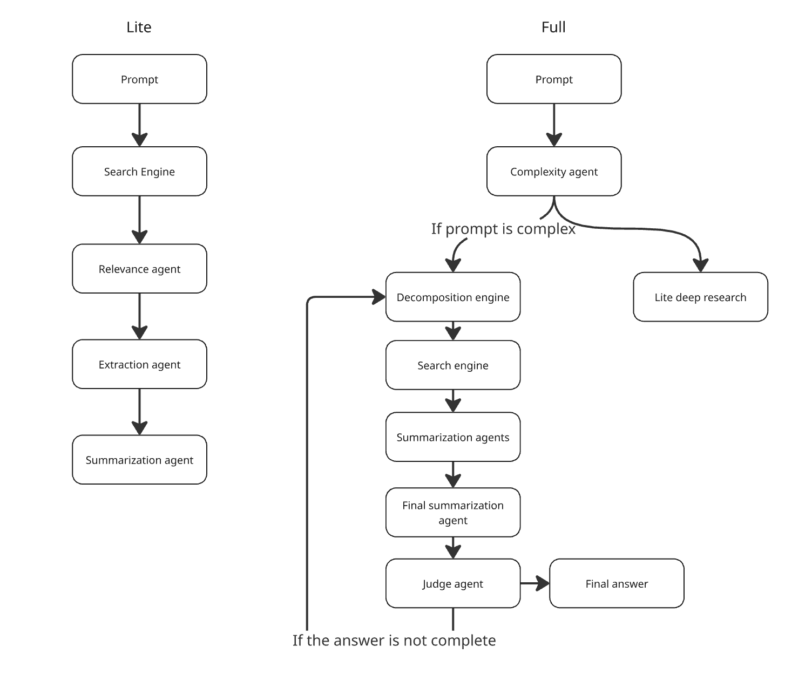

# 🔍 DiffResearch — DeepResearchBench Adapter (`drb_adapt` branch)

This branch adapts **DiffResearch** for evaluation on [DeepResearchBench](https://github.com/google-deepmind/deep_research_bench) — a benchmark of 100 complex research questions across diverse domains.

**Key changes vs `deep_research_bench` branch:**

- Prompts rewritten for research-quality output (structured reports, 600+ words)
- `DecomposeAgent` generates 4-5 diverse sub-queries covering different aspects
- `SummarizationAgent` produces structured reports with headers, evidence, and analysis
- `JudgeAgent` checks concrete coverage gaps, not just vague sufficiency
- `extra_body` / `enable_thinking` is now opt-in via `DISABLE_THINKING=1` env var
- `run_bench.py` adds `--always-complex`, `--search-delay`, `--top-n-*`, `--max-judge-iters` flags
- Bounded judge loop (default 2 iterations) to prevent infinite refinement

---

**Simple Deep Research** is an open-source, easy-to-run framework for building autonomous deep research systems. It works seamlessly with both open-source (via vLLM/llama.cpp) and proprietary LLM providers. **Simple Deep Research** is built without heavy abstractions like LangChain or LangGraph.

The framework is designed to automate the process of web searching, information synthesis, and report generation, minimizing the "hallucination" risk by grounding responses in real-time data.

---

## 🚀 Research Modes

The framework provides two distinct operational modes:

1.  **Lite Mode**: Optimized for speed. It generates a concise, accurate report on a given topic in one pass.
2.  **Full Mode**: Designed for complex queries. It iteratively decomposes the main question into sub-tasks, researches them individually, and uses a "Judge" agent to ensure the final report is comprehensive.

> [!TIP]
> Check the `examples/` directory in this repository to see sample reports generated by both modes.

---

## 🏗 Architecture




---

## 🛠 Setup & Installation

This project uses `uv` for lightning-fast Python package management.

1. **Clone repository**
   ```bash
   git clone https://github.com/alanrbtx/simple_deep_research
   cd simple_deep_research
   ```
   
2. **Install uv**:

   Follow the [official uv installation guide](https://github.com/astral-sh/uv).

4. **Create venv**:
   ```bash
   uv venv
   ```

   
3. **Install Dependencies**:
   ```bash
   uv pip install -r requirements.txt
   ```

4. **Configure LLM Backend**
```bash
export API_KEY="your_api_key"
export BASE_URL="http://your-provider-url/v1"
export MODEL_NAME="your-model-name"
```

## 💻Usage

### Lite Research
```bash
uv run run_lite_deep_research.py --prompt "What is GRPO?"
```

Available Flags:

--relevance: Adds an agent to filter search results for high accuracy.

--squeeze: Optimizes context usage by summarizing individual pages before final synthesis.


### Full Research

```bash
uv run run_full_deep_research.py --prompt "What is GRPO and how can I apply it to robotics?"
```
### DeepResearchBench

Place the benchmark data at `../deep_research_bench/data/prompt_data/query.jsonl`
(standard DeepResearchBench repo layout), then:

```bash
# Standard OpenAI-compatible API (e.g. OpenAI, Together, Fireworks)
export API_KEY="your_api_key"
export BASE_URL="https://api.openai.com/v1"
export MODEL_NAME="gpt-4o"

uv run run_bench.py --model-name gpt-4o --always-complex

# vLLM-served model with thinking disabled (e.g. Qwen3)
export DISABLE_THINKING=1
uv run run_bench.py --model-name qwen3-32b --always-complex --search-delay 3.0

# Resume an interrupted run
uv run run_bench.py --model-name gpt-4o --resume
```

Available flags for `run_bench.py`:

| Flag | Default | Description |
|---|---|---|
| `--model-name` | required | Output file stem |
| `--resume` | off | Skip already completed IDs |
| `--always-complex` | off | Skip complexity check; always use multi-query pipeline (recommended for bench) |
| `--search-delay` | 2.0s | Pause between DuckDuckGo requests |
| `--top-n-complex` | 4 | Sites per sub-query (complex mode) |
| `--top-n-simple` | 6 | Sites for single-query mode |
| `--max-judge-iters` | 2 | Max judge refinement rounds |

Output is written to `../deep_research_bench/data/test_data/raw_data/<model-name>.jsonl`.

### Important Note

Due to DuckDuckGo's strict rate limits, frequent automated queries may be throttled.
Use `--search-delay 3.0` or higher for long benchmark runs.


### 📄License

Licensed under the Apache License, Version 2.0.
